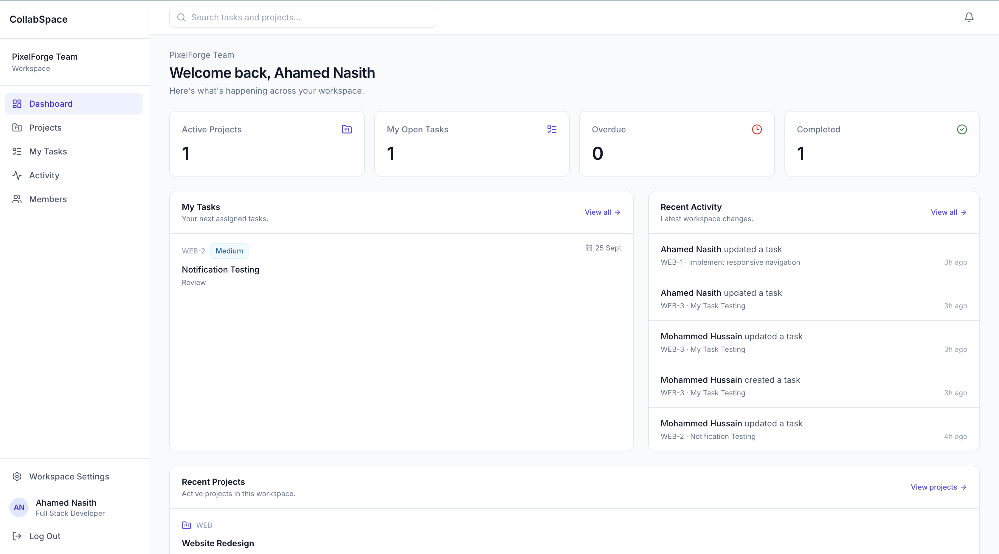
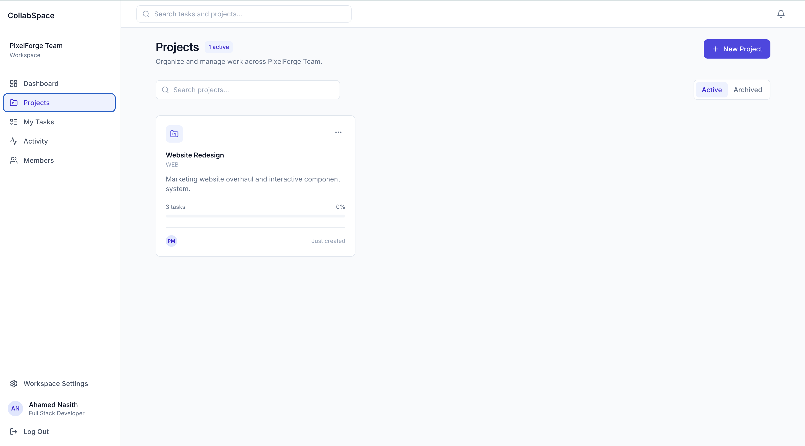
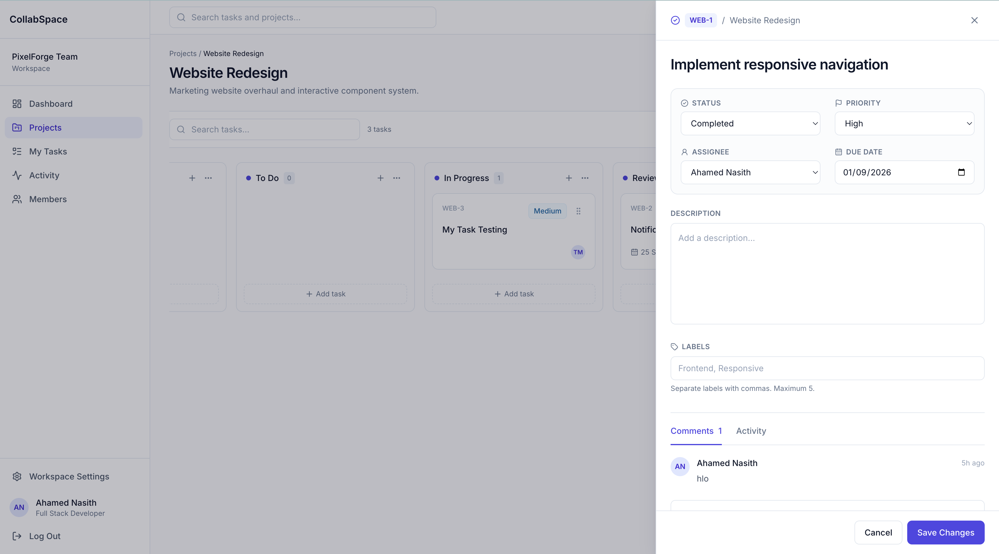
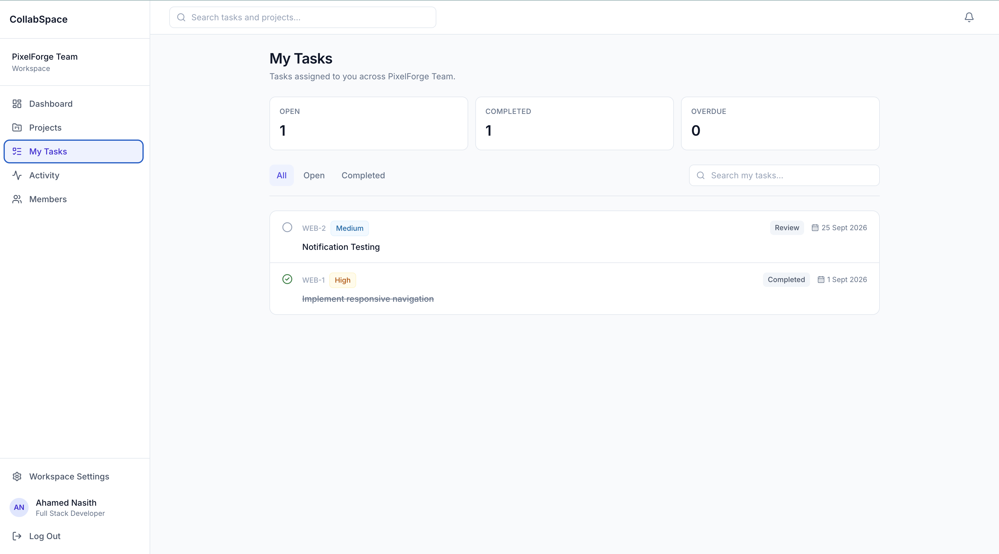
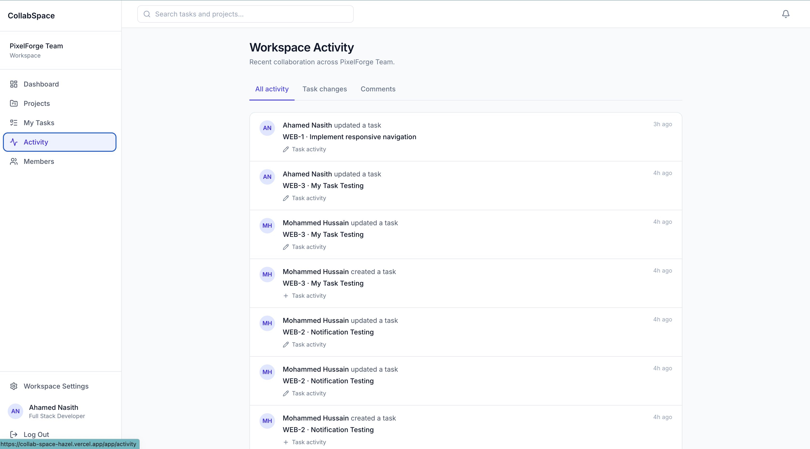
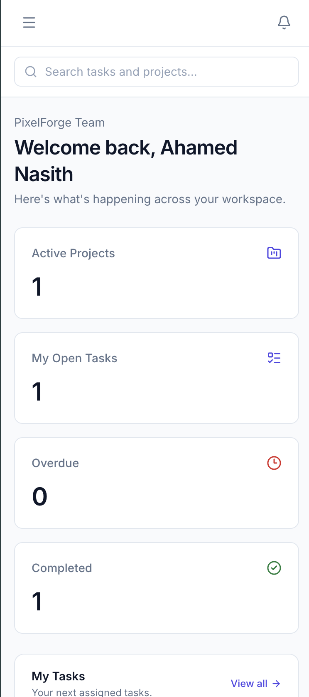

# CollabSpace

A real-time collaborative project management workspace built with React, Firebase, and Tailwind CSS.

CollabSpace enables teams to create workspaces, manage projects through Kanban boards, assign tasks, collaborate through comments, track activity, and receive real-time notifications.

## Live Demo

[View CollabSpace](YOUR_VERCEL_URL)

---

## Product Preview

### Dashboard



### Project Board



### Task Collaboration



### My Tasks



### Workspace Activity



### Responsive Experience



---

## Overview

CollabSpace is a SaaS-style collaborative project management application focused on real-time teamwork, task management, and workspace organization.

The application supports multi-user workspaces where members can collaborate on projects while changes are synchronized through Cloud Firestore.

The project demonstrates frontend architecture, Firebase Authentication, real-time data synchronization, Firestore Security Rules, role-based permissions, responsive UI development, and production deployment.

---

## Features

### Authentication

- Email/password registration
- Login and logout
- Password reset
- Persistent authentication sessions
- Protected application routes

### Workspace Management

- Create workspaces
- Invite members using secure invite links
- Join existing workspaces
- Owner, admin, and member roles
- Workspace settings
- Member directory

### Project Management

- Create projects
- Archive projects
- Project-specific task boards
- Project task numbering such as `WEB-1`, `WEB-2`

### Kanban Task Board

Tasks move through:

- Backlog
- To Do
- In Progress
- Review
- Completed

Additional capabilities:

- Drag-and-drop task movement
- Real-time board synchronization
- Priority management
- Assignees
- Due dates
- Labels
- Task descriptions

### Task Details

Task details open in a contextual side drawer without leaving the project board.

Users can update:

- Title
- Description
- Status
- Priority
- Assignee
- Due date
- Labels

Task URLs are deep-linkable:

```text
/app/projects/:projectId?task=:taskId
```

### Real-Time Collaboration

Cloud Firestore `onSnapshot` listeners synchronize application state between users in real time.

Real-time updates include:

- Task creation
- Task movement
- Task editing
- Comments
- Activity history
- Notifications
- Assignments

### Comments

- Real-time task comments
- Comment counters
- Author snapshots
- Multi-user collaboration

### Activity Tracking

Structured activity records capture events including:

- Task creation
- Status changes
- Task updates
- Comments

Activity is available both inside task details and across the workspace.

### Notifications

Recipient-specific notifications are created for relevant collaboration events.

Includes:

- Task assignment notifications
- Comment notifications
- Real-time unread badge
- Mark as read
- Mark all as read

### My Tasks

Users can view tasks assigned specifically to them.

Includes:

- Open tasks
- Completed tasks
- Overdue tasks
- Search
- Status filtering
- Real-time assignment changes

### Global Search

Workspace-wide search supports:

- Projects
- Tasks
- Task keys

Selecting a task opens its exact task details through deep linking.

### Dashboard

The real-time workspace dashboard displays:

- Active projects
- Open assigned tasks
- Completed tasks
- Overdue tasks
- Upcoming tasks
- Recent projects
- Recent workspace activity

---

## Tech Stack

### Frontend

- React
- JavaScript
- Vite
- Tailwind CSS
- React Router
- Lucide React
- dnd-kit

### Backend & Infrastructure

- Firebase Authentication
- Cloud Firestore
- Firestore Security Rules
- Vercel

---

## Architecture

The application follows a layered frontend architecture:

```text
UI Components
      ↓
Pages / Feature Components
      ↓
Custom Hooks / Context
      ↓
Services
      ↓
Firebase
```

Firebase operations are isolated inside service modules rather than being called directly from UI components.

Global application state is intentionally limited mainly to authentication and the active workspace.

Feature data such as tasks, projects, comments, activities, and notifications is handled through scoped real-time subscriptions.

---

## Firestore Data Model

The application uses the following top-level collections:

```text
users
workspaces
workspaceMembers
workspaceInvites
projects
tasks
comments
activities
notifications
```

Example task document:

```js
{
  workspaceId,
  projectId,

  key: "WEB-1",
  sequence: 1,

  title,
  description,

  status: "in_progress",
  priority: "high",

  assigneeId,

  labels: [],

  dueAt,
  position,

  commentCount,

  createdBy,
  createdAt,
  updatedAt,
  completedAt
}
```

---

## Real-Time Architecture

CollabSpace uses Firestore listeners for collaborative updates.

```text
User A updates a task
        ↓
Cloud Firestore
        ↓
onSnapshot listener
        ↓
User B interface updates
```

This allows users in the same workspace to see changes without manually refreshing the application.

---

## Security

Application authorization is enforced through Firestore Security Rules.

Rules validate:

- Authentication
- Workspace membership
- Owner/admin permissions
- Task and workspace relationships
- Project relationships
- Notification recipients
- Invite validity
- Allowed field updates

Frontend permission checks are used for user experience only. Authorization is enforced at the database layer.

---

## Key Engineering Decisions

### Transactional Task Numbering

Task identifiers such as:

```text
WEB-1
WEB-2
WEB-3
```

are generated using Firestore transactions.

Each project maintains its own task counter, reducing the risk of duplicate task numbers during concurrent task creation.

### Structured Activity Records

Activity is stored as structured data instead of only human-readable strings.

Example:

```js
{
  type: "task_status_changed",

  metadata: {
    taskKey: "WEB-1",
    fromStatus: "todo",
    toStatus: "in_progress"
  }
}
```

The UI converts these events into readable activity descriptions.

### Historical User Snapshots

Comments, activities, and notifications store lightweight user snapshots.

This preserves historical context even if a user later changes their profile name or avatar.

### Task Deep Linking

Task details are represented in the URL using:

```text
?task=TASK_ID
```

This allows exact tasks to be opened from:

- My Tasks
- Global Search
- Notifications
- Workspace Activity
- Dashboard

---

## Responsive Design

CollabSpace supports desktop, tablet, and mobile layouts.

Responsive behavior includes:

- Permanent desktop sidebar
- Mobile slide-over navigation
- Responsive global search
- Horizontally scrollable Kanban board
- Full-width task drawer on mobile
- Responsive dashboards, forms, and lists

---

## Local Development

Clone the repository:

```bash
git clone YOUR_REPOSITORY_URL
```

Install dependencies:

```bash
npm install
```

Create a local `.env` file using `.env.example`.

Required environment variables:

```env
VITE_FIREBASE_API_KEY=
VITE_FIREBASE_AUTH_DOMAIN=
VITE_FIREBASE_PROJECT_ID=
VITE_FIREBASE_STORAGE_BUCKET=
VITE_FIREBASE_MESSAGING_SENDER_ID=
VITE_FIREBASE_APP_ID=
```

Start the development server:

```bash
npm run dev
```

Create a production build:

```bash
npm run build
```

---

## Deployment

The frontend is deployed with Vercel.

Vercel environment variables provide the Firebase client configuration, and SPA rewrites ensure React Router routes work correctly when opened directly or refreshed.

---

## What I Learned

Building CollabSpace involved solving practical frontend engineering problems including:

- Designing a scalable Firestore data model
- Implementing multi-user real-time synchronization
- Building transactional task numbering
- Designing Firestore Security Rules around workspace membership
- Implementing role-based interfaces
- Handling optimistic drag-and-drop updates
- Building URL-driven task deep linking
- Managing Firebase Authentication state
- Structuring a React application around services and feature boundaries
- Building responsive SaaS-style interfaces
- Deploying and testing a production application
